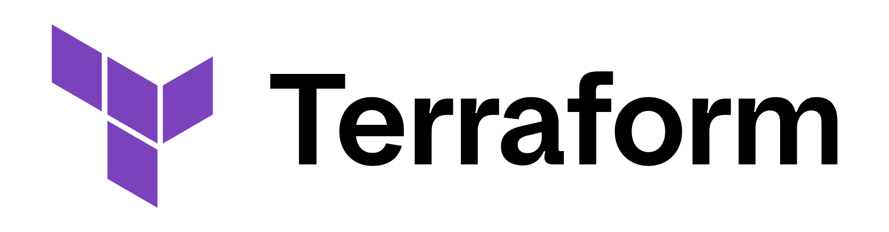

<h1 align="center"> Terraform Nexus </h1>  

  <a href="https://developer.hashicorp.com/terraform/intro">
    <source media="(prefers-color-scheme: dark)" srcset="_assets/Terraform_onDark.png" width="512">
    
  </a>

  A repository of Terraform building blocks I have used for building cloud resources.

## Cloud Providers

These are currently the cloud providers represented in this repository.

- [Amazon Web Services](./terraform-aws/README.md)
- [Microsoft Azure](./terraform-az/README.md)
- [Google Cloud Platform](./terraform-gcp/README.md)

## Organization

An important consideration is ensuring that Terraform template files are organized in proper directories, and also within the files they use a repeatable set of variables and follow best practices.

The `environment` and `infrastructure-live` directories are heavily influenced by the work of Anton Putra, whose work can be found on his [YouTube channel](https://www.youtube.com/@AntonPutra) and also in his [dedicated GitHub repo](https://github.com/antonputra/tutorials).

### Environments

Questions that arise when working out Terraform patterns are often related to the best way to manage environments. 

When you are working with multiple environments, if they need to look the same `terraform workspaces` can provide separate states for each environment using the same underlying IaC. 

However, if you have environments that have some fundamental differences, using `terraform workspaces` may not reduce difficulty keeping up with the environments. You can use separate directories to house your individual environments.

### CI/CD

We can use GitHub Actions to automatically handle terraform functions, as long as we specify a remote location for containing our state. In the examples for AWS, I use S3 to keep the terraform state files. A DynamoDB table can be used to lock the state files to a specific version when the terraform runs are performed.

The benefit to using this remote state is that it can be referenced outside of the automated pipeline if needed, without sacrificing the integrity of the state. The main challenge here is that if you use the GitHub Actions history for audit purposes, allowing runs outside of the mandated pipeline would be inadvisable.
